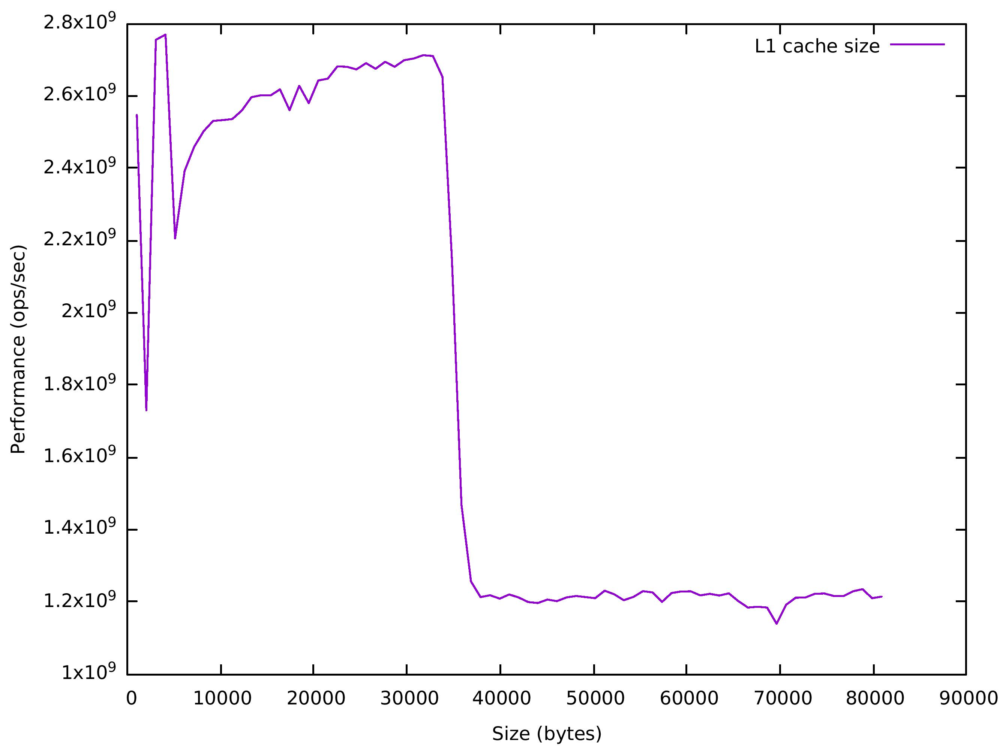
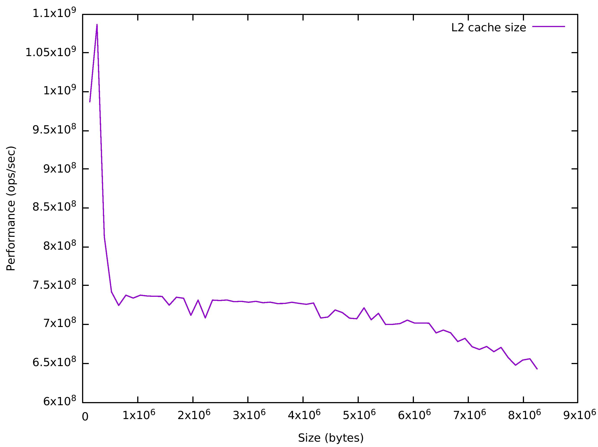
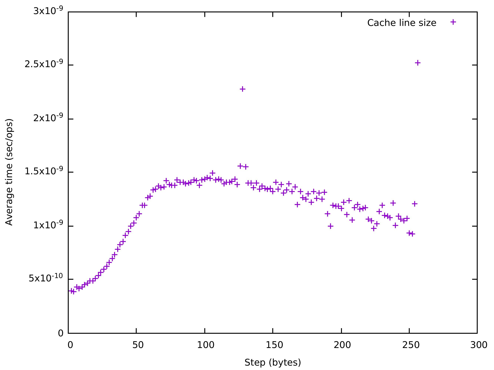

# Laborator 4

## Precizari intiale
### CPU
Intel i7-8700K @ 4.7GHz:
- L1 cache = 32K

- L2 cache = 256K

- L3 cache = 12M

- dimensiunea liniei de cache = 64 bytes

RAM = 16GB @ 3000MHz

## Task 1

### a
Programul ruleaza in general daca vectorul are o dimensiune `<= (1 << 32)`
(mai mica decat este imaginea procesului in memorie; ). Sectiunea bss are
dimensiunea egala cu numarul de octeti ocupati de vector + alti cativa bytes
pentru alinerea datelor (cred).

Problema cu taskul asta e ca atunci cand se ruleaza `cachegrind` pe el,
`valgrindul` moare pentru ca nu poate da `mmap()`-uri atat de mari... Din
motivul asta am declarat doar 10M elemente in vector. Cum era de asteptat dat
fiind ca se parcurg elementele unul dupa altul, rata de miss este minuscula atat
la L1 cat si la L3 (cat monitorizeaza `cachegrind` in `L` respectiv `LL`).

### b
Data fiind dimensiunea limitata a stivei (default 8MB pe Linux), se pot aloca
putin mai putin de `8MB/sizeof(struct particle)` elemente, adica 8MB/3. Dat
fiind ca atunci cand declaram vectorul in sine facem un acces la memorie, stiva
deja va fi in cacheul de date atunci cand parcurgem vectorul. Din acest motiv
sunt mult mai putine missuri in aceasta abordare.

### c
Cam ca la a, sistemul de operare o sa aloce maximum cat ii permite memoria
virtuala (16GB/proces), din care se scad spatiul pentru kernel, sectiunile de
cod, date, bss, rodata, heap si stiva.

## Task 2
Pentru aceste taskuri am incercat dezactivarea flagului `-O3`, dar rezultatele
nu au fost prea interesante.

### Varianta liniarizata (task2_lin)
Dat fiind ca toata matricea este o linie, missurile sunt la minimul posibil,
deci timpul de executie este mai mic.

Ruland cu `n = 10000` rata de miss este 0% (cu o eroare de 0.1%) pentru
instructiuni si 0.1% cu aceeasi eroare pentru date. Asadar, timpii de rulare
sunt ~3.5s.

### Varianta clasica (task2_mat)
Situatia este similara si aici intrucat matricea este parcursa pe linii, iar
missurile se vor genera doar putin mai des (la terminarea unei linii din
matrice vs la terminarea liniei efective din cache), motiv pentru care rata de
miss este similara cu cea de dinainte.

Din punctul de vedere al timpui de executie, si acesta este doar marginal mai
mare: in medie 3.6s pentru `n = 10000`.

Las in continuare outputurile rularii `cachegrind` pe cele 2 variante:

```
teo@obor Lab4 $ valgrind --tool=cachegrind ./task2_lin 10000
==3520== Cachegrind, a cache and branch-prediction profiler
==3520== Copyright (C) 2002-2017, and GNU GPL'd, by Nicholas Nethercote et al.
==3520== Using Valgrind-3.13.0 and LibVEX; rerun with -h for copyright info
==3520== Command: ./task2_lin 10000
==3520== 
--3520-- warning: L3 cache found, using its data for the LL simulation.
--3520-- warning: specified LL cache: line_size 64  assoc 16  total_size 12,582,912
--3520-- warning: simulated LL cache: line_size 64  assoc 24  total_size 12,582,912
viteza maxima este: 110.851250
==3520== 
==3520== I   refs:      38,681,050,339
==3520== I1  misses:             1,274
==3520== LLi misses:             1,258
==3520== I1  miss rate:           0.00%
==3520== LLi miss rate:           0.00%
==3520== 
==3520== D   refs:      16,700,189,865  (13,500,156,080 rd   + 3,200,033,785 wr)
==3520== D1  misses:        14,065,995  (     9,377,811 rd   +     4,688,184 wr)
==3520== LLd misses:        14,065,418  (     9,377,297 rd   +     4,688,121 wr)
==3520== D1  miss rate:            0.1% (           0.1%     +           0.1%  )
==3520== LLd miss rate:            0.1% (           0.1%     +           0.1%  )
==3520== 
==3520== LL refs:           14,067,269  (     9,379,085 rd   +     4,688,184 wr)
==3520== LL misses:         14,066,676  (     9,378,555 rd   +     4,688,121 wr)
==3520== LL miss rate:             0.0% (           0.0%     +           0.1%  )


teo@obor Lab4 $ valgrind --tool=cachegrind ./task2_mat 10000
==3657== Cachegrind, a cache and branch-prediction profiler
==3657== Copyright (C) 2002-2017, and GNU GPL'd, by Nicholas Nethercote et al.
==3657== Using Valgrind-3.13.0 and LibVEX; rerun with -h for copyright info
==3657== Command: ./task2_mat 10000
==3657== 
--3657-- warning: L3 cache found, using its data for the LL simulation.
--3657-- warning: specified LL cache: line_size 64  assoc 16  total_size 12,582,912
--3657-- warning: simulated LL cache: line_size 64  assoc 24  total_size 12,582,912
==3657== brk segment overflow in thread #1: can't grow to 0x4a4c000
==3657== (see section Limitations in user manual)
==3657== NOTE: further instances of this message will not be shown
viteza maxima este: 110.851250
==3657== 
==3657== I   refs:      37,683,610,596
==3657== I1  misses:             1,318
==3657== LLi misses:             1,302
==3657== I1  miss rate:           0.00%
==3657== LLi miss rate:           0.00%
==3657== 
==3657== D   refs:      16,601,085,999  (13,400,683,209 rd   + 3,200,402,790 wr)
==3657== D1  misses:        14,092,134  (     9,389,626 rd   +     4,702,508 wr)
==3657== LLd misses:        14,088,134  (     9,386,001 rd   +     4,702,133 wr)
==3657== D1  miss rate:            0.1% (           0.1%     +           0.1%  )
==3657== LLd miss rate:            0.1% (           0.1%     +           0.1%  )
==3657== 
==3657== LL refs:           14,093,452  (     9,390,944 rd   +     4,702,508 wr)
==3657== LL misses:         14,089,436  (     9,387,303 rd   +     4,702,133 wr)
==3657== LL miss rate:             0.0% (           0.0%     +           0.1%  )

```

## Task 3

### Fara optimizari de compilare (-O0)
Compilatorul reordoneaza variabilele i, l, a, b pentru aliniere. Astfel, primele
in ordinea scaderii adreselor de pe stiva sunt b-urile (aliniate la 32B in ciuda
dimensiunii structurii b de 24 octeti), urmate de a-uri, apoi l-uri si ultimele
sunt i-urile. Intrucat dimensiunile i-urilor, l-urilor si a-urilor sunt puteri
de 2, compilatorul aloca doar spatiu pentru acestea, neincercand sa le alinieze.

```
teo@obor Lab4 $ make task3
cc -std=c99 -g -Wall -O0    task3.c  -lm -o task3
teo@obor Lab4 $ ./task3
b5: 0x7ffe0e61aa20
b4: 0x7ffe0e61aa00
b3: 0x7ffe0e61a9e0
b2: 0x7ffe0e61a9c0
b1: 0x7ffe0e61a9a0
a5: 0x7ffe0e61a990
a4: 0x7ffe0e61a980
a3: 0x7ffe0e61a970
a2: 0x7ffe0e61a960
a1: 0x7ffe0e61a950
l5: 0x7ffe0e61a938
l4: 0x7ffe0e61a930
l3: 0x7ffe0e61a928
l2: 0x7ffe0e61a920
l1: 0x7ffe0e61a918
i5: 0x7ffe0e61a914
i4: 0x7ffe0e61a910
i3: 0x7ffe0e61a90c
i2: 0x7ffe0e61a908
i1: 0x7ffe0e61a904
struct a: 16
struct b: 24
aux_vect: 0x564ee7b02670
vect:     0x564ee7b02680
```

### Cu -O2 sau -O3
Se observa acelasi comportament. Dat fiind ca afisez adresele tuturor
variabilelor declarate, compilatorul nu poate sa elimine vreuna dintre ele.
Daca, in schimb, elimin afisarea unor variabile, compilatorul nu le mai declara,
iar adresele ramase sunt tot in ordine.

```
teo@obor Lab4 $ make task3
cc -std=c99 -g -Wall -O3    task3.c  -lm -o task3
teo@obor Lab4 $ ./task3
b5: 0x7fffa88d3d40
b4: 0x7fffa88d3d20
b3: 0x7fffa88d3d00
b2: 0x7fffa88d3ce0
b1: 0x7fffa88d3cc0
a5: 0x7fffa88d3cb0
a4: 0x7fffa88d3ca0
a3: 0x7fffa88d3c90
a2: 0x7fffa88d3c80
a1: 0x7fffa88d3c70
l5: 0x7fffa88d3c68
l4: 0x7fffa88d3c60
l3: 0x7fffa88d3c58
l2: 0x7fffa88d3c50
l1: 0x7fffa88d3c48
i5: 0x7fffa88d3c44
i4: 0x7fffa88d3c40
i3: 0x7fffa88d3c3c
i2: 0x7fffa88d3c38
i1: 0x7fffa88d3c34
struct a: 16
struct b: 24
aux_vect: 0x55846b494670
vect:     0x55846b494680
```

De precizat ca versiunea de _gcc_ folosita este `7.5.0`:
```
teo@obor Lab4 $ gcc --version
gcc (Ubuntu 7.5.0-3ubuntu1~18.04) 7.
```

### Alocare aliniata
Misto schema cu `(aux_vect + 31) & ~31`.

## Task 4

### L1


In imaginea de mai sus se gaseste plotul care ilustreaza dimensiunea cacheului
_L1_. In grafic se observa ca performanta incepe sa scada cam de pe la 32K, care
este fix dimensiunea cacheului _L1_ al procesorului meu.

### L2


In imaginea de mai sus se gaseste un grafic care incearca sa gaseasca
dimensiunea cacheului _L2_. Ce nu inteleg este de ce curba se aplatizeaza la
512K in timp ce cacheul meu _L2_ are 256K. Nu pricep de ce...

## Task 5


Curba pare ca se aplatizeaza pe la 64 bytes, care este si lungimea liniei de
cache a procesorului.